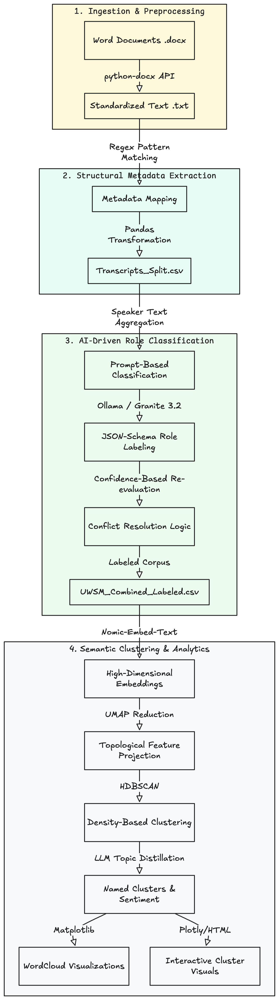

# United Way Survey Analysis — Pipeline

## 1. Introduction

This project processes and analyzes transcripts from community session collected by United Way. The raw input consists of 31 structured `.docx` files, each representing a recorded conversation with a community group. The pipeline transforms these files into a clean, structured dataset suitable for NLP analysis, topic modeling, and question-based semantic retrieval.

---

## 2. Project Description

Each source document contains metadata (facilitator name, date, organization), summary keywords, and a full conversation transcript. The pipeline reads these files, extracts and normalizes their content, and stores the output in a tabular DataFrame format.

The end goal is to answer specific research questions about community sentiment, values, and challenges — segmented by county, ALICE (Asset Limited, Income Constrained, Employed) status, and other demographic dimensions. The approach draws inspiration from Common Crawl-style text preprocessing, applying tokenization, whitespace normalization, deduplication, and embedding-based topic clustering to surface meaningful patterns across the corpus.

---

## 3. High-Level Goal

**Core Objective:** For each of the research questions posed in the assignment, generate:
- A summary of aggregate answers across all 31 conversations
- A general sentiment reading (positive, neutral, negative, mixed)
- Identification of differences by:
  - **County** — Are certain geographic areas expressing distinct concerns or strengths?
  - **ALICE Status** — Do asset-limited, income-constrained populations report different challenges, values, or levels of connectedness than higher-income groups?
  - **Other Demographics** — Age groups, organizational type (senior living, community group, etc.), meeting size, and population identifiers flagged in the data (e.g., groups identifying with one or more marginalized categories)

The output should make it straightforward to compare, for example, how transportation challenges are discussed in one county vs. another, or whether ALICE populations consistently report feeling more disconnected from community resources.

---

## 4. Initial Steps

### Pipeline Flow


---
### Step 1 — Read Source Files
- Iterate over all 31 `.docx` files
- Use `doc2txt` or `python-docx` to extract raw text
- Preserve document structure: INFO-TABLE block, IMAGE references, Summary Keywords section, and Transcript section

### Step 2 — Convert to `.txt`
- Write each document's extracted content to a corresponding `.txt` file
- Structure each `.txt` consistently:
  - Facilitator name
  - Date of conversation
  - Organization/group name
  - Summary keywords
  - Full transcript text

### Step 3 — Store Tabular Data
- Parse each `.txt` file and populate a Pandas DataFrame with the following columns:
  - `Name of Facilitator`
  - `Date of Conversation`
  - `Name of Organisation/Group`
  - `Meeting Location`
  - `Length of Time`
  - `Number of Attendees`
  - `Population — Identify for One or More Groups`
  - `Summary Keywords`
  - `Text`
  - `Number of Words in Full Text`

### Step 4 — Text Cleaning
Apply the following preprocessing in order:
1. **Whitespace removal** — strip leading/trailing whitespace, normalize internal spacing
2. **Sentence tokenization + filtering** — remove sentences with fewer than 3 words *unless* they contain a named entity
3. **Intra-sentence deduplication** — remove repeated words within a single sentence

### Step 5 — AI-Based Speaker Classification
This step utilizes the **Granite 3.2** model via **Ollama** to classify individual speakers based on their transcript contributions. Speakers are categorized into three primary roles:
1. **Facilitator**: Individuals who guide the conversation, ask questions, and remain neutral.
2. **ALICE (Asset Limited, Income Constrained, Employed)**: Participants describing personal financial struggles, instability, or lack of resources.
3. **Above ALICE**: Participants engaging from a position of financial stability, often discussing community issues abstractly or showing concern for others.

The classification process involves:
- Joining all dialogue segments for each unique speaker within a file.
- Using a structured JSON prompt to ensure consistent output from the LLM.
- Applying a refinement logic to ensure only one "Facilitator" is identified per transcript (choosing the highest confidence match) and re-evaluating ambiguous "Above ALICE" segments.
- Output is saved to `data/UWSM_Combined_Labeled.csv`.

### Step 6 — Topic Modeling and Sentiment Analysis
- **Embeddings**: Generate high-dimensional embeddings for classified segments using models like `sentence-transformers` or `nomic-embed-text`.
- **Clustering**: Apply algorithms (K-Means, HDBSCAN) to group community concerns into latent topics (e.g., transportation, housing, childcare).
- **Sentiment**: Aggregate sentiment scores per question per demographic segment to identify geographic and socio-economic variations.
- **Visualizations**: Generate WordClouds and interactive cluster maps (e.g., `view1_clusters.html`) for exploration.

---

## 5. How to Run the Pipeline

### Prerequisites
- Python 3.10+
- [Ollama](https://ollama.com/) installed and running.

### Installation
1. Install Python dependencies:
   ```bash
   pip install pandas numpy tqdm python-docx ollama matplotlib seaborn plotly mistralai wordcloud umap-learn hdbscan
   ```

### Setup and Initialization (Ollama)
The speaker classification requires the Ollama server and the Granite model.
1. **Initialize the Ollama Server**:
   ```bash
   ollama serve
   ```
2. **Pull the Granite 3.2 Model**:
   In a separate terminal window, run:
   ```bash
   ollama pull granite3.2:latest
   ```
   **OR**

   ```bash
   ollama pull qwen2.5:14b
   ```

**NOTE:** You are not limited just to these two models you can use any model that is open-source like `Qwen3-8B 4-bit quantized model`. All you have to do is change the model name in the code

### Running the Workflow
1. **Convert Word Documents**:
   ```bash
   python docx_to_txt.py
   ```
2. **Prepare Structured CSV**:
   ```bash
   python dataframe.py
   ```
3. **Run Speaker Classification**:
   Open and execute all cells in the Jupyter notebook:
   `speaker_analysis(granite).ipynb`
4. **Run Clustering & Analysis**:
   Explore findings and generate visualizations using:
   `efo_clustering_pipeline_v3.ipynb`